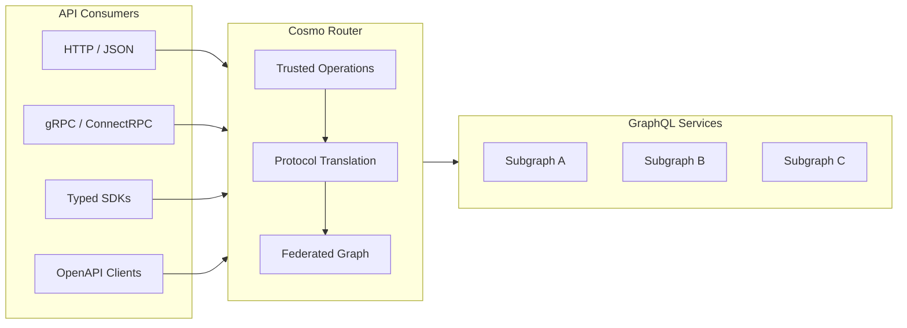

# ConnectRPC Tutorial
### Learn to Expose GraphQL APIs as Typed RPC Services

---

## The Problem

GraphQL is a powerful API design and composition layer. It gives platform teams strong typing, a single source of truth, and the ability to evolve schemas over time without breaking consumers. For many organizations, it is the right way to design and operate internal APIs.

However, GraphQL is not universally consumable. Many API consumers rely on REST, RPC, OpenAPI, or generated SDKs, or operate in environments where constructing GraphQL queries is difficult or impractical. In other cases, corporate governance or security policies explicitly prohibit exposing GraphQL at the edge. As a result, teams are often forced to either expose GraphQL directly and push its complexity onto every consumer, or reimplement the same API multiple times using different protocols — duplicating logic, contracts, and ongoing maintenance.

## Our approach: GraphQL as the source of truth, RPC as the interface

ConnectRPC in Cosmo keeps GraphQL at the center, but removes the need for API consumers to use it directly.

Instead of replacing GraphQL or exposing it as-is, Cosmo uses GraphQL Trusted Documents as the API contract and makes them available through other protocols. Platform teams continue to design and run their APIs in GraphQL, while consumers interact with the same API using their protocol of choice.

You define Trusted Documents - named and versioned GraphQL queries and mutations. Cosmo helps you turn these operations into:

- Protocol Buffer definitions
- Typed RPC endpoints
- HTTP/JSON APIs
- Generated SDKs
- OpenAPI specifications

Your existing GraphQL schema, resolvers, and federated setup stay the same.



Cosmo Router acts as as a mediation layer in front of your graph:

- It maps incoming RPC or HTTP requests to trusted GraphQL operations
- It executes those operations against your existing graph
- It returns results in the format and type system each consumer expects

## Why this matters

This approach makes it easier to serve different teams from one GraphQL graph:

**One API, multiple interfaces** 

You keep one GraphQL API, and Cosmo exposes it through HTTP/JSON, ConnectRPC, SDKs, and OpenAPI - without rebuilding the same functionality in new services.

**Strong types for consumers**

Consumers get typed clients and generated code, without needing to learn GraphQL or build queries by hand.

**Safer by default**

Only the operations you approve are exposed. This avoids "run any query" access and makes performance and data access more predictable.

**Easier to evolve**

Trusted operations act like stable API contracts. You can review, version, and update them as your schema changes.

**Fits existing workflows**

Platform teams keep using GraphQL. Consumers can keep using tools like Postman, REST/RPC workflows, and standard code generators.

With the above context in mind, let's walk through how to expose an existing GraphQL API in Cosmo as a ConnectRPC service.

## What You'll Learn

This tutorial teaches you how to expose an existing GraphQL API in Cosmo as a ConnectRPC Service, without rewriting resolvers or changing your underlying Graph.

You'll learn how to compile **Trusted Documents** into a strongly typed RPC interface, where Cosmo acts as a translation layer. This enables different API consumers to interact with your Graph using the protocol and tooling that fits them best.

**Key Concepts:**
- Converting GraphQL operations into Protocol Buffer definitions
- Running a ConnectRPC server alongside your GraphQL API
- Consuming the same API through multiple protocols (HTTP/JSON, gRPC, typed SDKs)
- Generating OpenAPI specifications from your operations

## Who Should Take This Tutorial

This tutorial is for users who already have a **monolithic or federated graph running in Cosmo** and want to expose it via ConnectRPC.

### API Producers

Teams building and evolving GraphQL schemas who want to:

* Expose APIs to non-GraphQL consumers safely via trusted operations
* Avoid maintaining multiple API implementations for the same domain

### API Consumers

Teams consuming APIs who want to:

* Use strongly typed SDKs, OpenAPI, or RPC-style APIs
* Integrate with familiar tooling and workflows
* Gain value from GraphQL-backed services without needing to learn GraphQL

## Learning Path

This tutorial is divided into three parts. Each part builds on the previous one:

### [Part 1: Operations to Proto](./docs/part-1-operations-to-proto.md)
**What you'll learn:** How to define GraphQL operations and compile them into Protocol Buffer definitions

**Time:** ~15 minutes

**You'll accomplish:**
- Author named GraphQL operations (Trusted Documents)
- Generate a `.proto` file from your operations
- Understand the mapping between GraphQL and Protocol Buffers

### [Part 2: Running the ConnectRPC Server](./docs/part-2-connectrpc-server.md)
**What you'll learn:** How to configure and run the Cosmo Router with ConnectRPC enabled

**Time:** ~10 minutes

**You'll accomplish:**
- Configure the router for ConnectRPC
- Start the ConnectRPC server
- Verify the service is running correctly

### [Part 3: Consuming the API](./docs/part-3-consuming-the-api.md)
**What you'll learn:** Multiple ways to interact with your ConnectRPC service

**Time:** ~20 minutes

**You'll accomplish:**
- Call your API using `curl` (HTTP/JSON)
- Call your API using `grpcurl` (gRPC)
- Generate TypeScript and Go SDKs
- Generate an OpenAPI specification

## Prerequisites

Before starting this tutorial, you need:

- [ ] Completed the [Cosmo Cloud Onboarding](https://cosmo-docs.wundergraph.com/getting-started/cosmo-cloud-onboarding)
- [ ] A federated graph named `demo` in the `development` namespace
- [ ] The `Products`, `Employee`, `Mood`, and `Availability` subgraphs running
- [ ] Ability to successfully query the federated graph via GraphQL
- [ ] The `wgc` CLI installed and available in your `$PATH`
- [ ] A valid `GRAPH_API_TOKEN`

**Quick verification:**
```shell
# Check if wgc is installed
wgc --version

# Verify your graph is accessible
wgc federated-graph fetch demo --namespace development
```

## What You'll Build

By the end of this tutorial, you will have:

- ✅ Taken an existing federated GraphQL API running in Cosmo
- ✅ Defined trusted GraphQL operations as stable API contracts
- ✅ Generated a strongly typed ConnectRPC service from those operations
- ✅ Served that service using the Cosmo Router
- ✅ Consumed the same API via:
  - curl (HTTP/JSON)
  - grpcurl (gRPC)
  - Generated TypeScript and Go SDKs
  - An OpenAPI specification

## Why This Matters

The goal is to reduce friction between API producers and API consumers. Platform and API teams can continue to design, evolve and govern their APIs in GraphQL, while consumers gain access through **strongly typed SDKs**, **OpenAPI**, **gRPC** - without the need to understand or adopt GraphQL themselves.

---

## Get Started

Ready to begin? Head to [Part 1: Operations to Proto](./docs/part-1-operations-to-proto.md) to start the tutorial.

## Need Help?

- 📚 [Cosmo Documentation](https://cosmo-docs.wundergraph.com/)
- 💬 [WunderGraph Community](https://wundergraph.com/community)
- 🐛 [Report an Issue](https://github.com/wundergraph/connectrpc-demo/issues)
